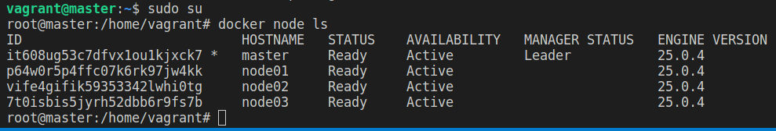

# dio-lab-docker-swarm-vagrant
Repositório do Desafio DIO - Definição de um Cluster Swarm Local com o Vagrant

Neste projeto nós criamos um cluster Swarm local com o Vagrant. Nas configurações do Vagrant nós definimos 4 máquinas virtuais, uma para ser o manager e três para serem os workers. 

Nós utilizamos o arquivo `master.sh` para inicializar o manager e salvar o token de acesso ao cluster no arquivo `worker.sh`. Com o token salvo, nós utilizamos o arquivo `worker.sh` para adicionar os workers ao cluster.

## Passos para executar o projeto

Para inicializar o cluster, execute o comando abaixo:

```bash
vagrant up
```

E para destruir o cluster, execute o comando abaixo:

```bash
vagrant destroy -f
```

## Resultado

